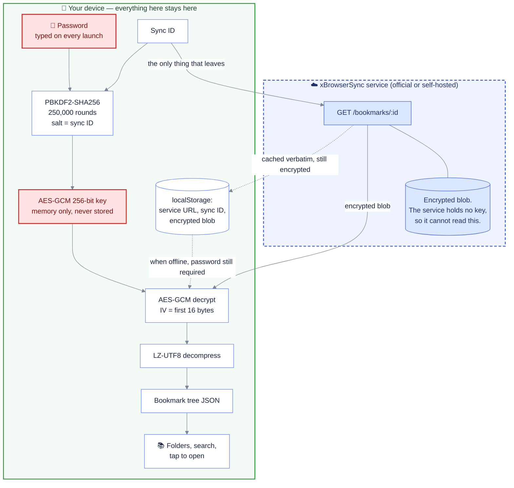

# xBrowserSync PWA (unofficial)

A small, installable, **read-only** mobile client for
[xBrowserSync](https://www.xbrowsersync.org) — the anonymous, end-to-end-encrypted
bookmark sync tool. It exists because there is no official iOS app; this runs from
the iOS or Android homescreen instead.

It is a static site with **zero runtime dependencies**: plain HTML, CSS and ES
modules. Nothing is bundled, minified or transpiled.

> **This is an unofficial third-party client.** It is not affiliated with,
> endorsed by, or supported by the xBrowserSync project. Bugs here are mine, not
> theirs — please do not report them to the xBrowserSync issue tracker.

## What it does

- Fetches the encrypted blob for your sync ID from the xBrowserSync REST API
- Decrypts it **in your browser** with the Web Crypto API
- Renders the folder hierarchy, with collapsible folders and search across
  titles, URLs, descriptions and tags
- Works offline against the last synced copy, always clearly labelled as cached
- Installs to the homescreen on iOS Safari and Android Chrome

It is **read-only by design**. Adding, editing, moving and deleting bookmarks are
deliberately not implemented — see [Roadmap](#roadmap).

## Privacy

- **Your password never leaves the device.** It is used only as PBKDF2 input,
  in-page, to derive a decryption key.
- **The password and the derived key are never written to disk.** They exist in
  memory for the lifetime of the page, which is why the app asks for the password
  each time it starts.
- **Only the encrypted blob is cached**, exactly as the API returned it. Offline
  use still requires your password, because decryption happens locally each time.
- **No analytics, no telemetry, no third-party requests.** The only network
  destination is the xBrowserSync service you configure. The Content-Security-Policy
  and a test in `tests/assets.test.mjs` both enforce this.
- The service itself never sees your password or plaintext — that is xBrowserSync's
  design, and this client preserves it.

### What is stored on the device

| Stored in `localStorage` | Not stored |
| --- | --- |
| Service URL | Password |
| Sync ID | Derived encryption key |
| Encrypted bookmarks blob | Decrypted bookmarks |

The sync ID and the encrypted blob are unencrypted at rest in the sense that any
process able to read this origin's `localStorage` can read them. The blob is
still ciphertext and useless without your password, but **anyone who can read
your device storage learns your sync ID**. "Forget this sync" clears all of it,
including the service worker caches.

## How it works

The red boxes never leave the browser. The only thing that ever crosses to the
service is your **sync ID** — never the password, never the key, never a
decrypted bookmark.



A wrong password fails loudly rather than quietly: AES-GCM is authenticated, so
the tag check rejects it instead of returning garbage. Note also that the API
answers **401 for "sync ID not found"**, not for a bad password — it never sees
one.

The decryption pipeline replicates the official client
([`crypto.service.ts`](https://github.com/xbrowsersync/app/blob/master/src/modules/shared/crypto/crypto.service.ts))
exactly:

```
key   = PBKDF2(password, salt = syncId, 250,000 iterations, SHA-256) -> AES-GCM 256
blob  = base64decode(response.bookmarks)
iv    = blob[0..16]        # 16-byte IV, not the more usual 12
json  = LZ-UTF8-decompress( AES-GCM-decrypt(blob[16..], key, iv) )
```

Two details are easy to get wrong and worth calling out:

1. The value the official client stores under the name `password` is not the
   password — it is the **base64 of the derived key**, imported directly as the
   AES key. There is no second derivation at decrypt time.
2. Data is **compressed before encryption** with
   [LZ-UTF8](https://github.com/rotemdan/lzutf8.js), not gzip or deflate.

Rather than ship the 25 KB `lzutf8` library for one function, `public/js/lzutf8.js`
is a ~40-line port of its decompressor. It is checked against the real library on
every test run — see [Tests](#tests).

### API endpoints used

All are `GET`; the client sends `Accept-Version: 1.1.9`, matching the official app.

| Purpose | Path |
| --- | --- |
| Fetch encrypted bookmarks | `/bookmarks/:id` |
| Last-updated timestamp | `/bookmarks/:id/lastUpdated` |
| Sync data version | `/bookmarks/:id/version` |
| Service info / status | `/info` |

Note that the API returns **401 for "sync ID not found"**, not for a bad password —
it never sees your password. A wrong password instead surfaces as an AES-GCM
authentication failure during decryption.

## Deploying to Netlify

The site is static with no build step, so deployment is just "publish the
`public/` directory".

### Option A — connect the repo (recommended)

1. Push this repo to GitHub.
2. In Netlify: **Add new site → Import an existing project**, pick the repo.
3. Accept the settings from `netlify.toml` (publish directory `public`, no build
   command). Deploy.
4. Netlify provisions HTTPS automatically via Let's Encrypt, including on custom
   domains and the free tier.

Every push to `main` redeploys; branches and PRs get preview URLs. The headers in
`netlify.toml` are path-based, so previews need no per-URL configuration.

### Option B — drag and drop

Drag the `public/` folder onto the Netlify dashboard. You lose the `netlify.toml`
headers and redirects this way, so option A is preferable.

### Confirm HTTPS before use

Open the deployed URL and check it is `https://`. The app refuses to run otherwise,
because Web Crypto, service workers and PWA install **all** require a secure
context. `http://localhost` also counts as secure, which is what `npm run serve`
uses.

### Self-hosted xBrowserSync instances

`connect-src https:` in the CSP lets you point the app at any HTTPS instance
without redeploying. Your instance must also allow cross-origin requests from
your site's domain: the API's `allowedOrigins` setting defaults to `[]`, which
permits all origins, but if you have set it, add your Netlify domain.

To restrict this app to a single instance, replace `connect-src https:` in
`netlify.toml` with that origin.

## Installing on a phone

**iOS (Safari 16.4+):** open the site in **Safari** (not Chrome or an in-app
browser), tap **Share** → **Add to Home Screen** → **Add**. Launch it from the
homescreen icon to get the standalone window.

**Android (Chrome):** open the site, tap **⋮** → **Install app** / **Add to Home
screen**. Chrome may also show an install prompt on its own.

You will be asked for your password each time the app is launched cold. That is
intentional, not a bug.

## Local development

```bash
npm install     # dev dependencies only (lzutf8, used solely by the tests)
npm run serve   # http://localhost:8000
npm test
npm run icons   # regenerate the icon set
```

The icons are generated procedurally by `tools/generate-icons.js`, which writes
PNGs using only Node's `zlib` — no image libraries. The generated icons are
committed, so this only needs rerunning if you change the design.

## Tests

`npm test` runs Node's built-in test runner against **the exact files the browser
loads**. 23 tests across three files:

- **`tests/lzutf8.test.mjs`** — checks the decompressor against the real `lzutf8`
  package over emoji, CJK, RTL text, long-range matches, deeply nested bookmark
  trees and a 1 MB payload. This is the test that matters most: silent
  decompression divergence would corrupt bookmarks invisibly.
- **`tests/crypto.test.mjs`** — encrypts payloads exactly the way the official
  client does, then decrypts them with the shipped code. Also asserts that a
  wrong password, a truncated payload and tampered ciphertext are all *rejected*
  rather than silently mis-decrypted.
- **`tests/assets.test.mjs`** — verifies every referenced file exists, the
  manifest is installable, the iOS meta tags are present, the CSP needs no
  `unsafe-inline`, and no third-party origin appears anywhere in the app.

## Roadmap

Read-only was a deliberate first step: the write path is where a crypto or
schema mistake could **corrupt your real bookmarks**, so it should not be built
until the read path has been confirmed against real syncs.

Possible next steps, roughly in order of value:

- **v2 — writing.** Requires the compressor as well as the decompressor, plus
  the `PUT /bookmarks/:id` conflict protocol (`lastUpdated` must match or the
  API returns 409). Bookmark IDs and the `[xbs] …` container conventions have to
  be honoured exactly.
- A device passcode or WebAuthn/biometric gate, so the derived key could be
  cached between launches without leaving it readable at rest.
- Legacy sync support (pre-API-1.1.3 syncs, which skip PBKDF2 and use the raw
  password as the key). Currently detected and refused with a clear message.
- Favicons for bookmarks — deliberately omitted, since fetching them would leak
  your browsing habits to third-party servers and break the privacy model.

## Credits and licence

[xBrowserSync](https://www.xbrowsersync.org) is by Nick Bolton and contributors
(GPL-3.0). This client is an independent project; the decryption logic follows
the official [app](https://github.com/xbrowsersync/app) and
[api](https://github.com/xbrowsersync/api) implementations.

This repository is MIT licensed.
